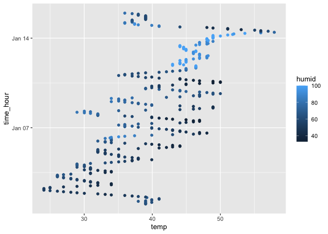

p8105_hw1_zl2746
================
Ze Li
2023-09-15

``` r
#install.packages("moderndive")
library(moderndive)
library(tidyverse)
```

# Problem 1

``` r
data("early_january_weather")
summary(early_january_weather)
```

    ##     origin               year          month        day              hour      
    ##  Length:358         Min.   :2013   Min.   :1   Min.   : 1.000   Min.   : 0.00  
    ##  Class :character   1st Qu.:2013   1st Qu.:1   1st Qu.: 4.000   1st Qu.: 6.00  
    ##  Mode  :character   Median :2013   Median :1   Median : 8.000   Median :11.50  
    ##                     Mean   :2013   Mean   :1   Mean   : 8.039   Mean   :11.53  
    ##                     3rd Qu.:2013   3rd Qu.:1   3rd Qu.:12.000   3rd Qu.:17.75  
    ##                     Max.   :2013   Max.   :1   Max.   :15.000   Max.   :23.00  
    ##                                                                                
    ##       temp            dewp           humid           wind_dir    
    ##  Min.   :24.08   Min.   : 8.96   Min.   : 32.86   Min.   :  0.0  
    ##  1st Qu.:33.98   1st Qu.:19.94   1st Qu.: 51.34   1st Qu.:140.0  
    ##  Median :39.02   Median :26.06   Median : 61.67   Median :240.0  
    ##  Mean   :39.58   Mean   :28.06   Mean   : 65.48   Mean   :208.2  
    ##  3rd Qu.:44.96   3rd Qu.:35.06   3rd Qu.: 78.68   3rd Qu.:290.0  
    ##  Max.   :57.92   Max.   :53.06   Max.   :100.00   Max.   :360.0  
    ##                                                   NA's   :5      
    ##    wind_speed       wind_gust         precip            pressure   
    ##  Min.   : 0.000   Min.   :16.11   Min.   :0.000000   Min.   :1011  
    ##  1st Qu.: 5.754   1st Qu.:19.56   1st Qu.:0.000000   1st Qu.:1018  
    ##  Median : 8.055   Median :21.86   Median :0.000000   Median :1022  
    ##  Mean   : 8.226   Mean   :22.53   Mean   :0.002039   Mean   :1023  
    ##  3rd Qu.:11.508   3rd Qu.:25.32   3rd Qu.:0.000000   3rd Qu.:1027  
    ##  Max.   :24.166   Max.   :31.07   Max.   :0.190000   Max.   :1034  
    ##                   NA's   :308                        NA's   :38    
    ##      visib          time_hour                     
    ##  Min.   : 0.120   Min.   :2013-01-01 01:00:00.00  
    ##  1st Qu.: 9.000   1st Qu.:2013-01-04 19:15:00.00  
    ##  Median :10.000   Median :2013-01-08 12:30:00.00  
    ##  Mean   : 8.515   Mean   :2013-01-08 12:28:09.39  
    ##  3rd Qu.:10.000   3rd Qu.:2013-01-12 05:45:00.00  
    ##  Max.   :10.000   Max.   :2013-01-15 23:00:00.00  
    ## 

``` r
nrow(early_january_weather)
```

    ## [1] 358

``` r
ncol(early_january_weather)
```

    ## [1] 15

There are 15 variables in `early_january_weather` dataset.

There are 4 time variables: year, month, day and hour.

The year variable is 2013 and all data is happened in this year.

The month variable is 1 which means all data is happened in Jan 2013.

The day variable has min value 1 and max value 15, which means that the
dataset only has 15 days in 2013.

The hour variable has min value 0 and max value 23, which means that it
measures 23 hours in a day.

The other 11 variables are factors of weather.

The temperature variable ranged from 24.08 to 57.92, having a mean of
39.58.

The dewp variable ranged from 8.96 to 53.06.

The humid variable ranged from 32.86 to 100.

The wind_direction variable ranged from 0 to 360, having 5 null values.

The wind_speed variable ranged from 0 to 24.166.

The wind_gust variable ranged from 16.11 to 31.07, having 308 null
values.

The precip variable ranged from 0 to 0.19.

The pressure variable ranged from 1011 to 1034, having 38 null values.

The visible variable ranged from 0.12 to 10.

The time_hour variable ranged from 2013-01-01 01:00:00.00 to 2013-01-15
23:00:00.00.

The dataset has 358 rows and 15 columns.

Next, making a scatterplot of `temp (y)` vs `time_hour (x)`.

``` r
ggplot(early_january_weather, 
       aes(x=temp, y=time_hour, color = humid,
           xlab = 'temperature'), ylab = 'time hour') + geom_point()
```

<!-- -->

``` r
ggsave('temp_vs_timehour_by_humid.pdf')
```

    ## Saving 7 x 5 in image

In the first 10 days, there is low temperature below around 50, and
humid is below around 60.

During day 10 to day 14, the temperature gradually increase to the
maximum around 60 and humid increases to 100 as color becomes lighter.

In the last day, the temperature decreases suddenly to 40.

# Problem 2

``` r
problem2_df=
  tibble(
    samp=rnorm(10,sd = 1),
    vec_logical = samp>0,
    vec_char = c('book','mac','bag','ipad','phone','coffee','hat','water','mouse','pen'),
    vec_factor = c('low','medium','high','low','medium','high','low','medium','high','low')
)    
problem2_df
```

    ## # A tibble: 10 × 4
    ##       samp vec_logical vec_char vec_factor
    ##      <dbl> <lgl>       <chr>    <chr>     
    ##  1  0.187  TRUE        book     low       
    ##  2 -1.10   FALSE       mac      medium    
    ##  3  1.24   TRUE        bag      high      
    ##  4 -0.111  FALSE       ipad     low       
    ##  5  1.46   TRUE        phone    medium    
    ##  6  0.0192 TRUE        coffee   high      
    ##  7 -0.242  FALSE       hat      low       
    ##  8  1.77   TRUE        water    medium    
    ##  9 -0.448  FALSE       mouse    high      
    ## 10 -1.19   FALSE       pen      low

Using `as.numeric` function,

``` r
as.numeric(problem2_df$samp)
```

    ##  [1]  0.18666626 -1.10378812  1.23860551 -0.11057261  1.45892051  0.01917393
    ##  [7] -0.24153072  1.76808420 -0.44840163 -1.19351859

``` r
as.numeric(problem2_df$vec_logical)
```

    ##  [1] 1 0 1 0 1 1 0 1 0 0

``` r
as.numeric(problem2_df$vec_char)
```

    ## Warning: NAs introduced by coercion

    ##  [1] NA NA NA NA NA NA NA NA NA NA

``` r
as.numeric(problem2_df$vec_factor)
```

    ## Warning: NAs introduced by coercion

    ##  [1] NA NA NA NA NA NA NA NA NA NA

``` r
mean(problem2_df$samp)
```

    ## [1] 0.1573639

``` r
mean(problem2_df$vec_logical)
```

    ## [1] 0.5

``` r
mean(problem2_df$vec_char)
```

    ## Warning in mean.default(problem2_df$vec_char): argument is not numeric or
    ## logical: returning NA

    ## [1] NA

``` r
mean(problem2_df$vec_factor)
```

    ## Warning in mean.default(problem2_df$vec_factor): argument is not numeric or
    ## logical: returning NA

    ## [1] NA

Using `pull` function,

``` r
mean(problem2_df %>% pull(samp))
```

    ## [1] 0.1573639

``` r
mean(problem2_df %>% pull(vec_logical))
```

    ## [1] 0.5

``` r
mean(problem2_df %>% pull(vec_char))
```

    ## Warning in mean.default(problem2_df %>% pull(vec_char)): argument is not
    ## numeric or logical: returning NA

    ## [1] NA

``` r
mean(problem2_df %>% pull(vec_factor))
```

    ## Warning in mean.default(problem2_df %>% pull(vec_factor)): argument is not
    ## numeric or logical: returning NA

    ## [1] NA

The normal distribution and logical vector have mean of 0.0496 and 0.5,
since the logical vector is transfer into 0 and 1.

However, character vector and factor vector don’t work to take mean.
Both of them are transferred into NA.
